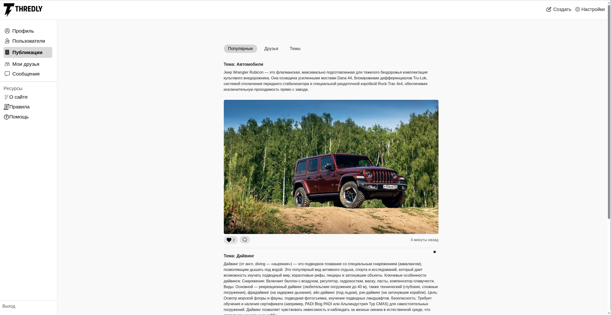
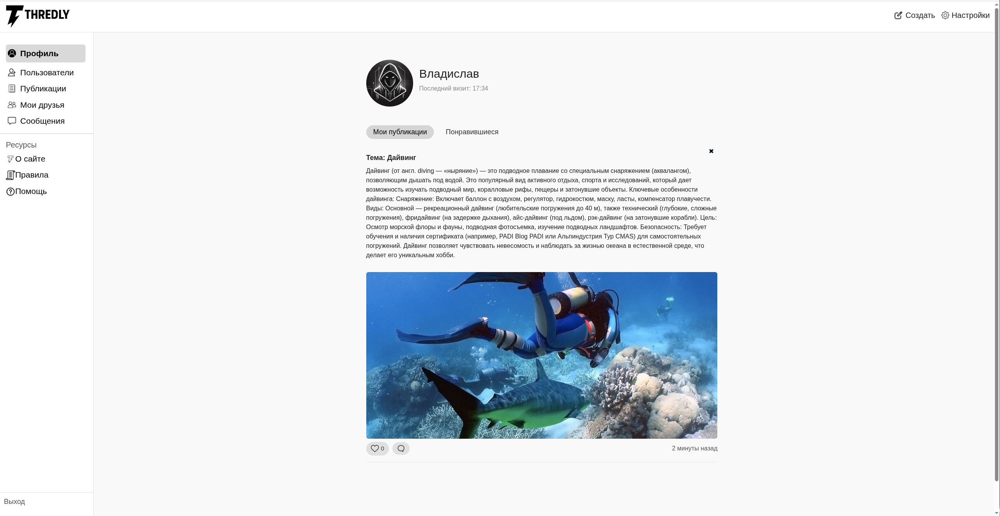
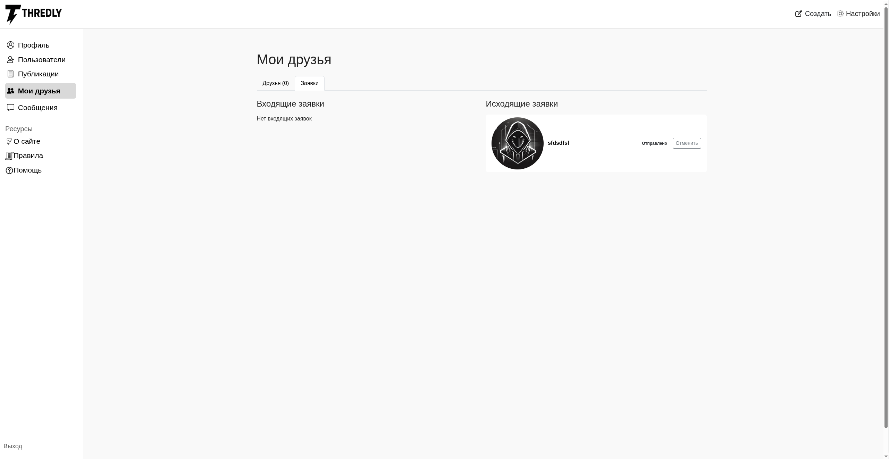
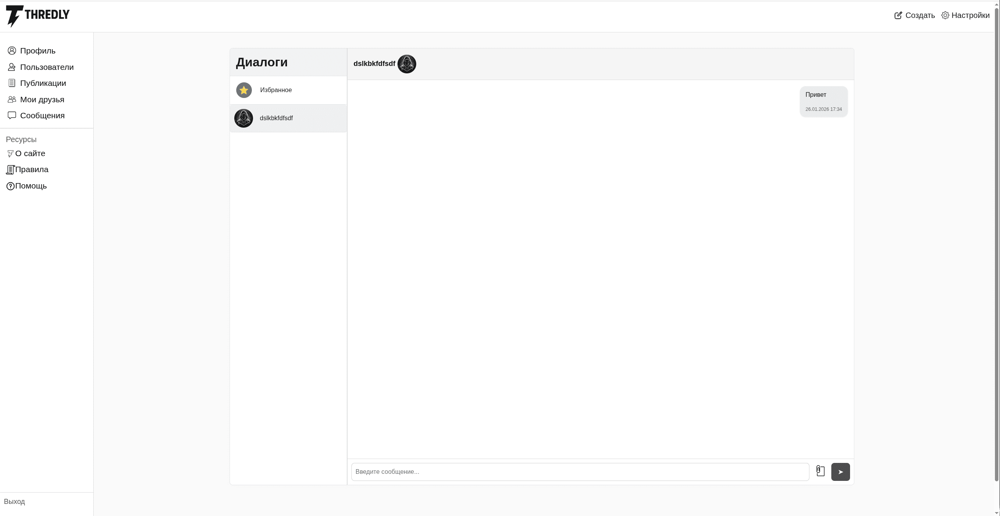

# Thredly

**Thredly** — веб‑приложение, объединяющее социальную сеть и форум, ориентированное на анонимное, безопасное и тематическое общение. Проект создан в учебных целях для глубокого изучения фреймворка **Django** и современной веб‑инфраструктуры.

---

## 🧠 Идея проекта

Thredly — это пространство, где пользователи могут:

* свободно выражать мысли без страха осуждения;
* обсуждать волнующие темы с незнакомыми людьми;
* делиться творчеством и получать честную обратную связь;
* находить поддержку и понимание.

Анонимность сохраняется **между пользователями**, при этом соблюдаются правила сообщества и модерации.

---

## 👥 Персоны пользователей

### 1️⃣ Студент — Антон, 19 лет

* **Кто:** студент 1 курса, будущий программист
* **Цель:** делиться мыслями и шутками без давления знакомых
* **Боль:** страх показаться глупым в обычных соцсетях
* **Контекст:** заходит между учебой и делами

**Jobs to be Done:**

* иметь безопасное анонимное пространство;
* находить друзей с похожим мышлением.

---

### 2️⃣ Уставший офисный сотрудник — Иван, 35 лет

* **Кто:** офисный работник, женат, есть дети
* **Цель:** получить поддержку и совет
* **Боль:** не с кем обсудить переживания в реальной жизни
* **Контекст:** вечером за ноутбуком после работы

**Jobs to be Done:**

* анонимно делиться проблемами;
* читать истории людей в похожей ситуации.

---

### 3️⃣ Креативный интроверт — Мария, 27 лет

* **Кто:** дизайнер‑фрилансер
* **Цель:** делиться творчеством и находить заказчиков
* **Боль:** неискренняя реакция знакомых в соцсетях
* **Контекст:** днём публикует работы, вечером общается

**Jobs to be Done:**

* получать честную обратную связь;
* вдохновляться чужими работами;
* находить потенциальных клиентов.

---

## 🧭 User Story

### 🔹 Первый заход на сайт

* **Проблема:** пользователь не понимает, что это за платформа и какие данные собираются
* **Решение:**

  * краткое описание проекта на форме входа;
  * правила сообщества и политика данных;
  * чекбокс согласия с правилами при регистрации.

---

### 🔹 Поиск по темам

* **Проблема:** общая лента со случайными постами
* **Решение:**

  * полнотекстовый поиск;
  * тематические вкладки и ленты.

---

### 🔹 Просмотр ленты

* **Проблема:** возможен неприемлемый контент
* **Решение:**

  * кнопка жалобы под каждым постом;
  * автоматическое скрытие постов при большом числе жалоб;
  * блокировка нарушителей.

---

## 🧩 Функциональность

* Посты и комментарии
* Тематические ленты
* Поиск по постам
* Добавление друзей
* Лайки и комментарии
* Регистрация и авторизаеция
* Настройка профиля и смена пароля

---

## 🛠 Технологии

* **Backend:** Django 5.2
* **Database:** PostgreSQL
* **Cache / Broker:** Redis
* **Web server:** Nginx
* **Frontend:** HTML, CSS, js
* **Контейнеризация:** Docker, Docker Compose

---

## ⚙️ Установка и запуск

### 1️⃣ Клонирование репозитория

```bash
git clone https://github.com/Faris325/Social-network.git
cd Social-network
```

### 2️⃣ Запуск через Docker

```bash
docker compose up --build
```

### 3️⃣ Открытие приложения

Перейдите в браузере по адресу:

```
http://127.0.0.1:80
```

---

## 📷 Скриншоты











---


## 📄 Назначение проекта

Проект разработан **исключительно в учебных целях** для изучения Django и построения полноценного веб‑приложения с использованием современной инфраструктуры.

---

## 📄 Лицензия

MIT License
